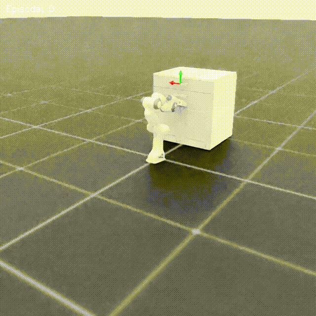
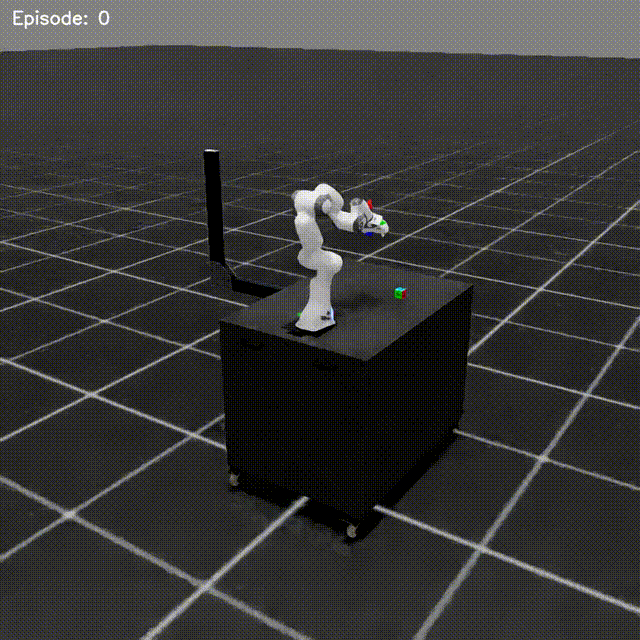

## PPO Implementation - IsaacLab

<table>
  <tr>
    <td></td>
    <td></td>
    <td></td>
  </tr>
  <tr>
    <td></td>
    <td></td>
    <td></td>
  </tr>
</table>

This is the implementation of PPO Algorithm in PyTorch.

Tested on following hardware specs
- Ubuntu 24.04
- 16GB RAM
- RTX 4070 8GB VRAM

The model training and inference is run in headless and the evals are rendered headlessly and saved as videos

### Setup:
```
git clone ###
cd ###
```
Install uv
```
pip3 install uv
```
```
uv sync
```

The installation takes some time like $\approx 20mins$

### Run a training
```
uv run myscripts/MyPPO_Isaac.py --env "$ENV_NAME"
```

### Run Evaluation
```
uv run myscripts/MyPPO_Isaac.py --env "$ENV_NAME" --mode test
```

